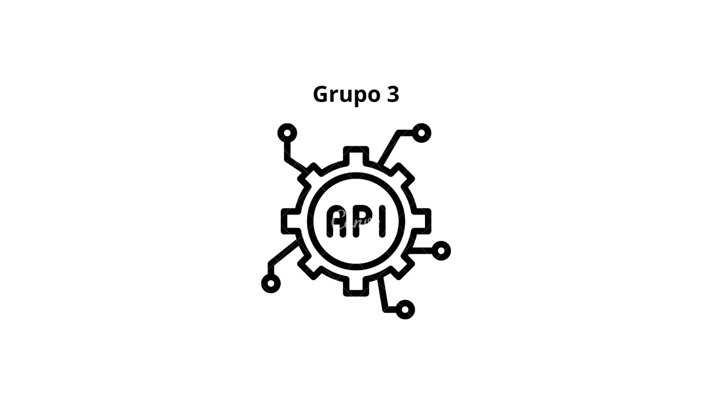

# ApiRestfullGrupo3

<h1 align="center">
   API E-Commerce
</h1>

  

## Tecnologias Utilizadas

- [Insomnia](https://insomnia.rest)
- [Github](https://github.com/)
- [Git v2.41.0.3](https://git-scm.com/downloads)
- [Trello](https://trello.com/pt-BR)
- [SpringBoot](https://spring.io/tools/)
- [DBeaver](https://dbeaver.io)

## Autores do projeto

| [ ASAEL SEIFFERT](https://github.com/LexSeiffert) |[ BERNARDO REUTHER](https://github.com/YoloDesu) | [ MARCO AURELIO](https://github.com/Rofogale) | [ LUCAS GONZAGA](https://github.com/olucasgon)|[ LILIANE DAVID](https://github.com/LilianeDavid93) |
| :--------------------------------------------------------------------------------------------------------------------------------------------: | :----------------------------------------------------------------------------------------------------------------------------------------------: | :-------------------------------------------------------------------------------------------------------------------------------------------: | :----------------------------------------------------------------------------------------------------------------------------------------: | :-----------------------------------------------------------------------------------------------------------------------------------------:
